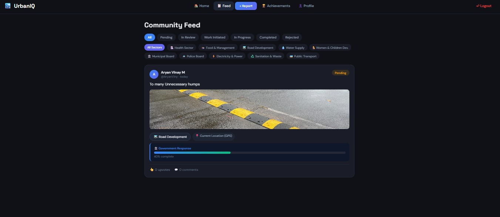
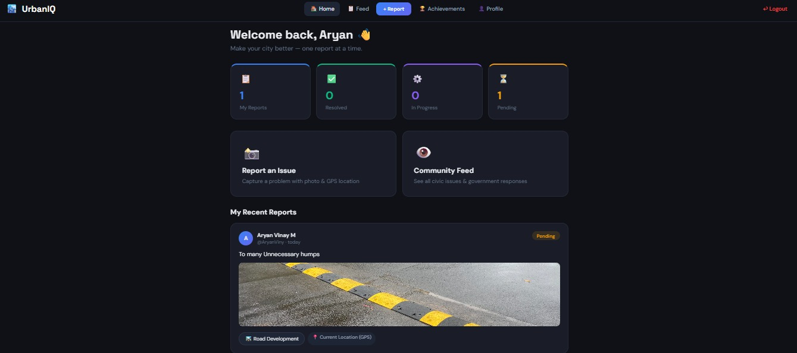
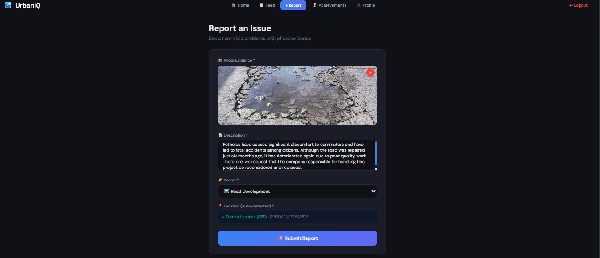
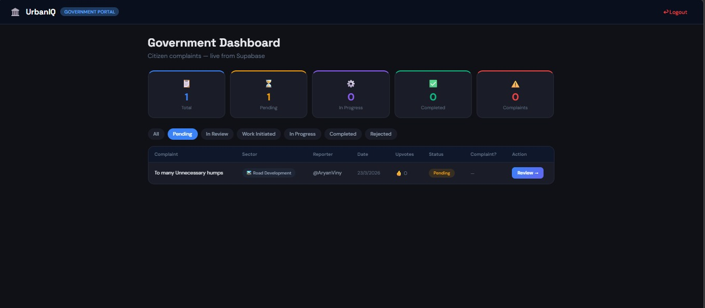
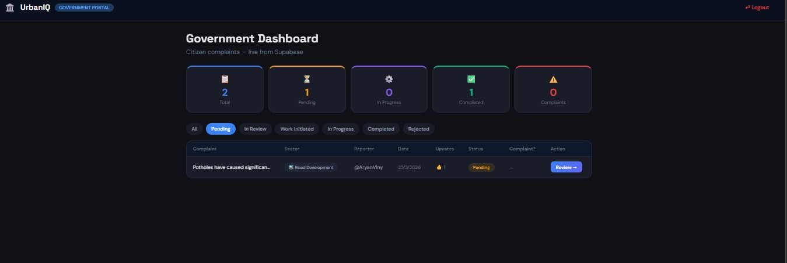
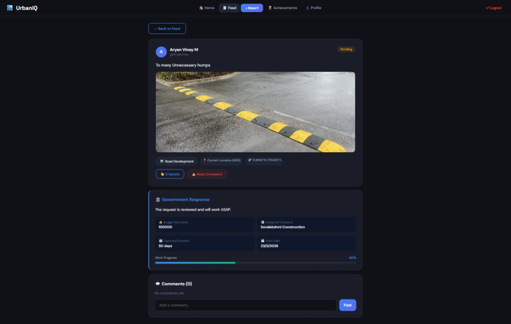
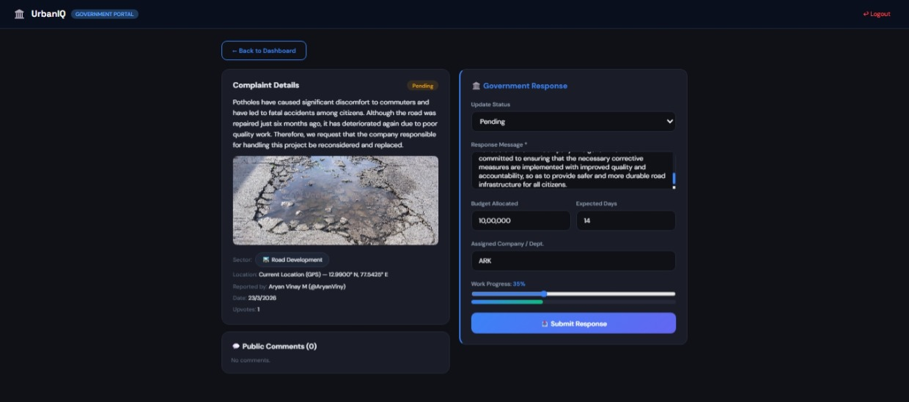
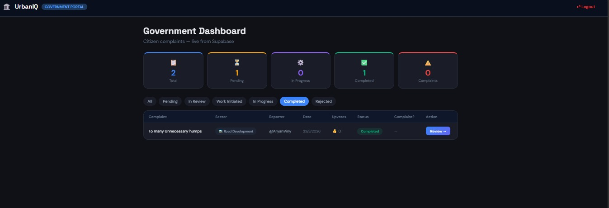

<h1 align="center">UrbanIQ – Civic Intelligence Platform</h1>

A web-based platform enabling citizens and government authorities to collaborate for efficient urban issue resolution through transparency, real-time updates, and community engagement.

---

<h2 align="center">About</h2>

UrbanIQ is a civic intelligence platform designed to bridge the gap between citizens and government authorities by enabling transparent, efficient, and real-time communication regarding urban issues. The application allows citizens to report problems such as potholes, sanitation concerns, and infrastructure gaps, while providing government bodies with a centralized system to manage, track, and resolve these issues effectively.

Built as a web-based solution, UrbanIQ focuses on community-driven reporting, data transparency, and accountability. Every reported issue is visible, trackable, and updated in real time, transforming traditional complaint systems into a more interactive and responsive ecosystem.

The system consists of a Citizen Interface for reporting and tracking issues and a Government Dashboard for monitoring, decision making, and resolution tracking.

---

<h2 align="center">Tech Stack</h2>

HTML | CSS | JavaScript | Vite

---

<h2 align="center">Features</h2>

<h3 align="center">Citizen Interface</h3>

 User POV interface for reporting civic issues
  

 Image upload system with location based reporting
  

 Pothole complaint submission and tracking

Secure Aadhaar based signup, issue reporting with images and GPS, community interaction through comments and upvotes, and real time complaint tracking.

---

<h3 align="center">Government Dashboard</h3>

 Administrative dashboard showing issue statistics
  

 Government response and decision update system
  

 Pending projects and task management view

Centralized dashboard for reviewing complaints, assigning agencies, allocating budgets, updating progress, and providing official responses.

---

<h3 align="center">Community Feed</h3>

 Users sharing ideas and interacting on issues
  

 Government perspective on reported issues

Public feed with filtering options, transparent updates, and community engagement features to increase participation.

---

<h3 align="center">Achievements and Progress Tracking</h3>

 Completed projects and progress overview

Displays completed and ongoing projects with progress tracking to improve accountability and visibility.

---

<h2 align="center">Project Highlights</h2>

Designed as a real world civic engagement solution with focus on transparency, usability, and efficient governance.

---

<h2 align="center">Future Scope</h2>

AI based issue prioritization, mobile application support, and advanced analytics for government decision making.

